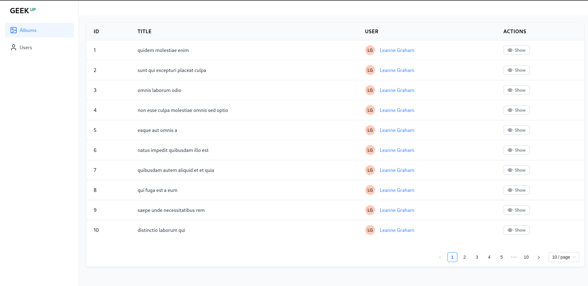
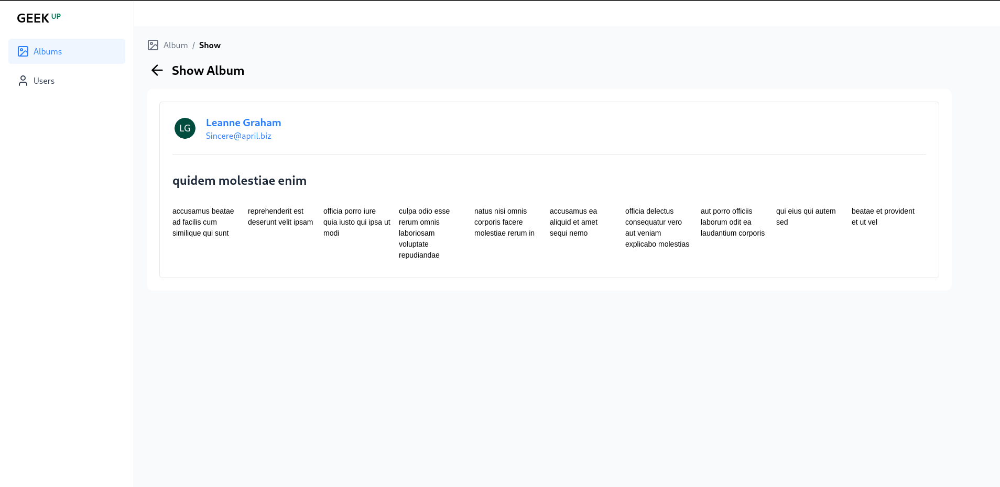
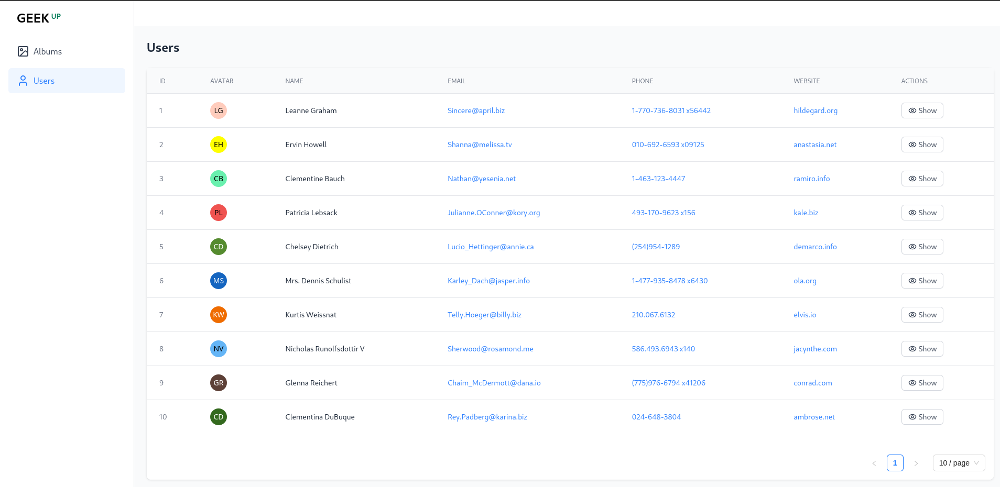
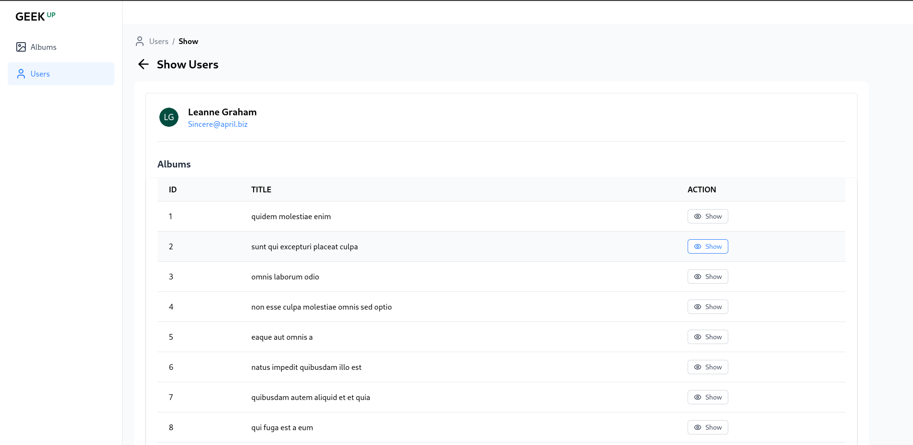

# PRODUCT FRONTEND TECHNICAL ASSESSMENT

This is the frontend application for the **PRODUCT FRONTENDTECHNICAL ASSESSMENT - GEEK UP INTERNSHIP 2025**.

You can check out the live demo here: [https://geekup-internship2025.vercel.app/](https://geekup-internship2025.vercel.app/)

---

## Tech Stack & Libraries Used

- **React**
- **TailwindCSS**
- **Ant Design**
- **Lucide Icon**

---

## Setup Instructions

1. Clone the repository:
   ```
   git clone https://github.com/Nagnie/GEEKUP_Internship2025.git
   cd your-repo
   ```

2. Install dependencies:
    ```
    npm install
    ```

3. Start the development server:
   ```
   npm start
   ```

4. Open your browser and go to http://localhost:5173 to see the running app.

---

## Screenshots

### Album Table


### Album Detail


### User Table


### User Detail

